# Prime number sieve in C

This is a test of how fast I can write a prime sieve, although I am no expert. 
The following is some auto-generated statistics from it running on github actions:

| Test          | Runtime (s)   |
| :---          |          ---: |
|500000 @ -O0|0.035622|
|500000 @ -O1|0.036606|
|500000 @ -O2|0.036748|
|500000 @ -O3|0.036906|
|1000000 @ -O0|0.100372|
|1000000 @ -O1|0.101065|
|1000000 @ -O2|0.101452|
|1000000 @ -O3|0.101589|
|5000000 @ -O0|4.539743|
|5000000 @ -O1|4.877433|
|5000000 @ -O2|4.717895|
|5000000 @ -O3|4.869674|
|10000000 @ -O0|15.770475|
|10000000 @ -O1|16.526323|
|10000000 @ -O2|16.438343|
|10000000 @ -O3|16.229771|

<sup><i>Generated at 02/14/2024 13:32:51 EST</i></sup>
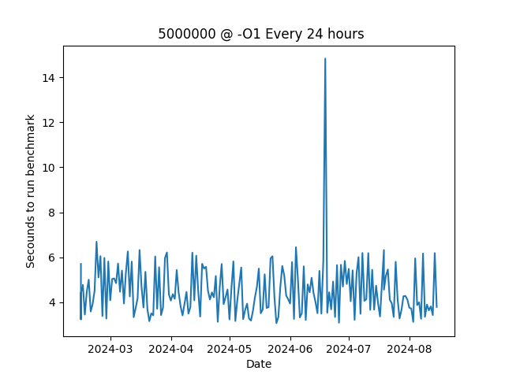
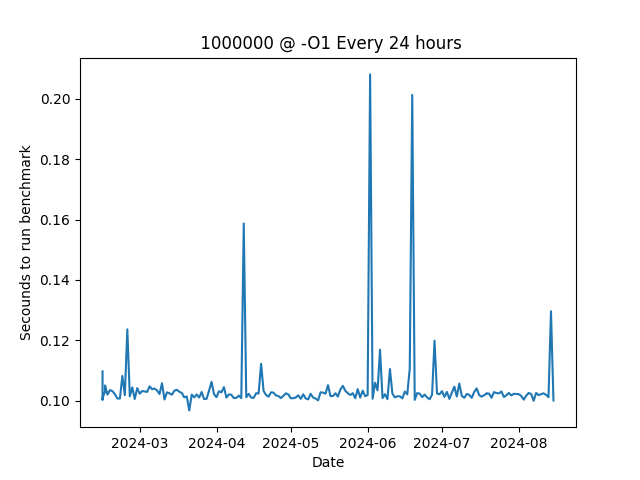
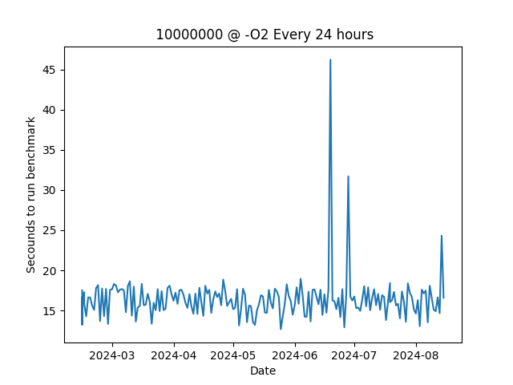
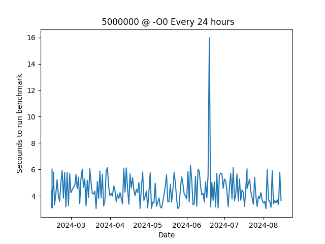
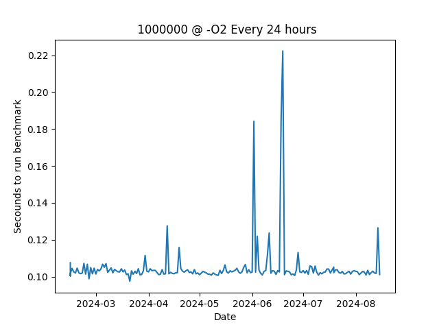
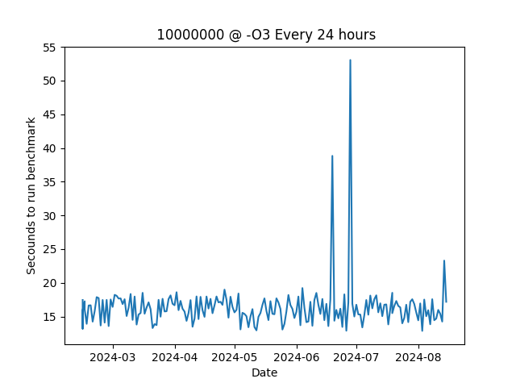
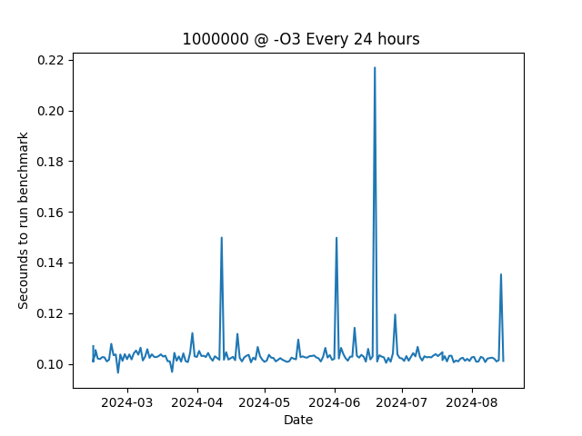
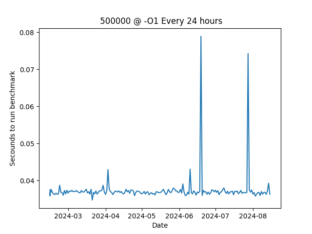
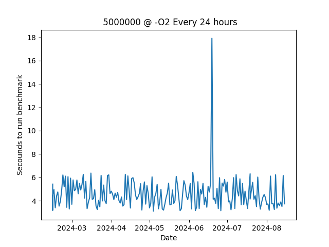
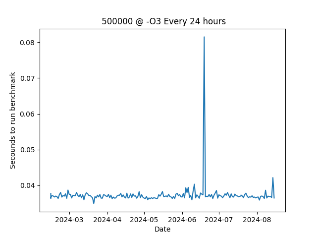

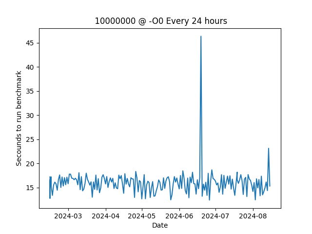
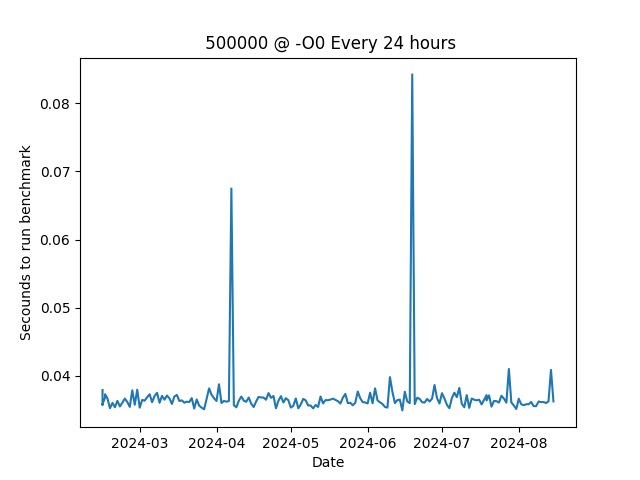

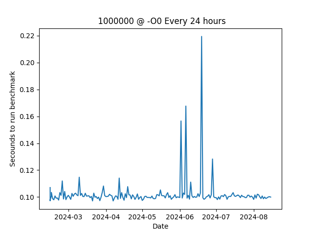


## Copyright
```
 Copyright (C) 2024  HeronErin

 This program is free software: you can redistribute it and/or modify
 it under the terms of the GNU Affero General Public License as published by
 the Free Software Foundation, either version 3 of the License, or
 (at your option) any later version.

 This program is distributed in the hope that it will be useful,
 but WITHOUT ANY WARRANTY; without even the implied warranty of
 MERCHANTABILITY or FITNESS FOR A PARTICULAR PURPOSE.  See the
 GNU Affero General Public License for more details.

 You should have received a copy of the GNU Affero General Public License
 along with this program.  If not, see <https://www.gnu.org/licenses/>.
```